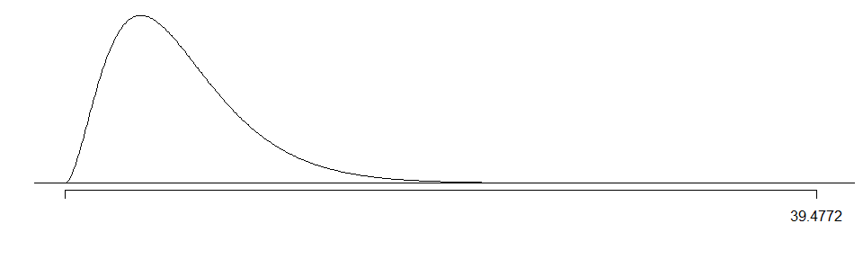

# Perceptions on Job Satisfaction and Satisfaction with Current Financial Situation (DASI Analysis Project)
18 October 2014  

<!-- For more info on RMarkdown see http://rmarkdown.rstudio.com/ -->

<!-- Enter the code required to load your data in the space below. The data will be loaded but the line of code won't show up in your write up (echo=FALSE) in order to save space-->


<!-- In the remainder of the document, add R code chunks as needed -->

### Introduction:

This analysis will investigate responses to two questions from the GSS survey, in an attempt to answer the following question: Is there a relationship between job satisfaction and satisfaction with their current financial situation?

With the echoes of the Global Financial Crisis of 2008/2009 still being felt, it will take decades for world economies to recover. A strong economy requires consumers to have the inclination and ability to participate in transactions that support the flow of money within the system.  From a federal fiscus perspective, employment provides several necessary inputs into the economy - liquidity (money available), tax income (for debt servicing and social programmes) and indicators of economic stability, health and trends.

While the actual numeric value of transactions give one type of view on economic health, consumer perceptions are a key driver of measuring the "heartbeat" of an economy. With the spiraling costs of health care and aid, it is critical that the economically productive portion of the population continue to push money into the system to stimulate growth and opportunity.  

Having a positive outlook with regards to economic ability is inclined to provide impetus to participate in economic activities, thereby providing the necessary transactions to drive growth and recovery within the economy.  Given that employment is the primary source of income for the majority of the population, investigating perceptions around job satisfaction and household financial situations, can potentially provide insight into future economic trends.

Anecdotal evidence suggests that a person's satisfaction with their current financial situation and their job satisfaction are correllated - the more satisfied they are with their working environment, the more positive their outlook on the potential for growth within the company, the more likely they are to participate in economic activities (spending, investing) instead of saving every penny against the possibility of being unemployed.  

### Data:

The data for this analysis was taken from the General Social Survey (GSS) data set (please see full [citation](#citation) at the end of this document). 

Data was collected for the period from 1970 to 2012 using some or all of the following methods: computer-assisted personal interviews (CAPI), face-to-face interviews and telephone interviews. English and Spanish speaking individuals (cases) 18 years or older living in the United States of America were asked several sets of questions and their answers recorded for each.  Not all the questions were asked in all the years.  

According to the GSS website [<sup>(1)</sup>](#response), a 70% or higher response rate was recorded for the years this analysis will focus on - 2000-2012.  The GSS team made use of a multi-stage area probability sampling method [<sup>(2)</sup>](#sample) to arrive at the necessary quotas for a representative sample of the general American population based on the 1970 Census Tract data.

The GSS is an observational study, and while every effort has been made to ensure that it is random and representative, there is a possibility that some sampling bias has been introduced into the data set, for example the non-response bias (individuals not available for the interview, or refusing to complete the survey).  Prior to 2006, only English speaking individuals were surveyed.  From 2006 onwards, Spanish speaking individuals were included as well.  A robust sampling methodology as detailed in the cited document [<sup>(2)</sup>](#sample) post-2006 and attempts to correct for any sampling bias, allows us to consider generlizing the the results of the analysis to the American population **with caution**.  As this is an observational study, with no control group, we will not be able to make any causal inference with regards to the results of the analysis.

For the purposes of this analysis, the following variables were subset from the full cumulative file: *year* (ordinal variable), *satfin* (categorical variable with 3 levels - Satisfied, More or Less, Not At All Sat) and *satjob* (categortical variable with 4 levels - Very Satisfied, Mod Satisfied, A Little Dissat, Very Dissatisfied).  The year variable was only included to enable further subsetting of the data set to only include the years 2000 - 2012.   


```r
colnames2 <- c("year", "satfin", "satjob"); gssSub2 <- gss[ , colnames2] ## Subsetting the data
finData <- gssSub2[gssSub2$year == 2000:2012, 2:3]
```

The resultant dataset has 1458 observations of 2 variables.

### Exploratory data analysis:


```r
summary(finData) ## Summary Statistics
```

```
            satfin                  satjob   
 Satisfied     :319   Very Satisfied   :405  
 More Or Less  :478   Mod. Satisfied   :342  
 Not At All Sat:326   A Little Dissat  : 97  
 NA's          :335   Very Dissatisfied: 28  
                      NA's             :586  
```

From the summary statistics above, it is clear that there are several cases where there is missing data (coded NA) in both the variables we're interested in exploring. Possible reasons for no data in the variables:  
* No data for job satisfaction - respondent is unemployed, a home maker or retired.  
* No data for satisfaction with current financial situation - respondent could be unwilling to answer the questions or be in a household where the question is not applicable to their personal situation (e.g. living with parents).

Exploring the reasons for no data in the chosen variables, while interesting, falls outside the scope of this analysis.  Therefore the data set will need to be subset even further to remove the incomplete cases for further exploratory analysis.


```r
finFinal <- finData[complete.cases(finData), ] ## Isolating complete cases only
summary(finFinal) ## Summary Statistics
```

```
            satfin                  satjob   
 Satisfied     :216   Very Satisfied   :387  
 More Or Less  :377   Mod. Satisfied   :330  
 Not At All Sat:247   A Little Dissat  : 96  
                      Very Dissatisfied: 27  
```

From the original 1458 cases available for analysis, there is only a set of 840 complete observations available.


```r
finPlot <- finFinal; levels(finPlot$satfin) <- c("Sat (Fin)", "MoreLess (Fin)", "NotSat (Fin)"); levels(finPlot$satjob) <- c("VSat", "MSat", "LDis", "VDis")

par(mfrow=c(1,2))
barplot(table(finPlot$satfin, finPlot$satjob), legend=TRUE, beside = TRUE, col = heat.colors(3), main = "Financial Situation by Job Satisfaction", xlab = "Job Satisfaction", ylab = "Financial Satisfaction (# of observations)", cex.axis = 0.66)
mosaicplot(table(finPlot$satfin, finPlot$satjob), color = topo.colors(4), main = "Financial Satisfaction vs Job Satisfaction", sub = "Job Satisfaction", ylab = "Satisfaction - Financial Situation")
```

 


```r
tableTotal <- nrow(finFinal); jSuc <- 387 + 330; jFin <- 216 + 377
```

The summary statistics and plots indicate that the majority of the respondents (**0.8536**) are either *very satisfied* or *more or less satisfied* with their job situation and the majority of respondents (**0.706**) are also *very satisfied* or *moderately satisfied* with their financial situation at the time of the survey.  While the hypothesis test and inference has not been done yet, this suggests that the possibility exists for some interplay between the two variables.


### Inference:

####Method of Inference

Given that we are comparing two categorical variables, both of which have more than two levels, we can only use the Chi Square Test for Independence to evaluate the two variables - the proportions across several groups.  This method informs the hypotheses to be tested, the conditions that need to be met but there is no associated confidence interval for this test.  The explanetory varibale is Job Satisfaction (**satjob**) and the response variable is Satisfaction with Financial Situation (**satfin**).

####Hypotheses 

*$H_0$* : Satisfaction with current financial situation and job satisfaction are independent. Financial satisfaction rates **do not** vary by job satisfaction.  
*$H_A$* : Satisfaction with current financial situation and job satisfaction are dependent. Financial satisfaction rates **do** vary by job satisfaction.  

####Checking Conditions 


```r
library(Gmisc); library(plyr)

## Building the data table with row & column totals
freqTable <- table(finFinal$satjob, finFinal$satfin); freq2 <- as.data.frame.matrix(freqTable)
colTotal <- apply(freq2, 2, sum); freq2 <- rbind(freq2, colTotal)
rowNames <- row.names(freq2); rowNames[5] <- "columnTotal"; row.names(freq2) <- rowNames
freq2 <- mutate(freq2, rowTotal=apply(freq2, 1, sum))

htmlTable(freq2, align = "c|c|c|c", caption = "Table - Frequency of scenarios from sample data : Job Satisfaction (Columns) 
          by Financial Satisfaction (Rows)")
```

<table class='gmisc_table' style='border-collapse: collapse;' >
	<thead>
	<tr><td colspan='5' style='text-align: left;'>
	Table - Frequency of scenarios from sample data : Job Satisfaction (Columns) 
          by Financial Satisfaction (Rows)</td></tr>
	<tr>
		<th style='font-weight: 900; border-bottom: 1px solid grey; border-top: 4px double grey;'>freq2</th>
		<th style='border-bottom: 1px solid grey; border-top: 4px double grey; text-align: center;'>Satisfied</th>
		<th style='border-bottom: 1px solid grey; border-top: 4px double grey; text-align: center;'>More Or Less</th>
		<th style='border-bottom: 1px solid grey; border-top: 4px double grey; text-align: center;'>Not At All Sat</th>
		<th style='border-bottom: 1px solid grey; border-top: 4px double grey; text-align: center;'>rowTotal</th>
	</tr>
	</thead><tbody>
	<tr>
		<td style='text-align: left;'>Very Satisfied</td>
		<td style='text-align: center;'>131</td>
		<td style='text-align: center;'>168</td>
		<td style='text-align: center;'>88</td>
		<td style='text-align: center;'>387</td>
	</tr>
	<tr>
		<td style='text-align: left;'>Mod. Satisfied</td>
		<td style='text-align: center;'>69</td>
		<td style='text-align: center;'>158</td>
		<td style='text-align: center;'>103</td>
		<td style='text-align: center;'>330</td>
	</tr>
	<tr>
		<td style='text-align: left;'>A Little Dissat</td>
		<td style='text-align: center;'>11</td>
		<td style='text-align: center;'>41</td>
		<td style='text-align: center;'>44</td>
		<td style='text-align: center;'>96</td>
	</tr>
	<tr>
		<td style='text-align: left;'>Very Dissatisfied</td>
		<td style='text-align: center;'>5</td>
		<td style='text-align: center;'>10</td>
		<td style='text-align: center;'>12</td>
		<td style='text-align: center;'>27</td>
	</tr>
	<tr>
		<td style='border-bottom: 1px solid grey; text-align: left;'>columnTotal</td>
		<td style='border-bottom: 1px solid grey; text-align: center;'>216</td>
		<td style='border-bottom: 1px solid grey; text-align: center;'>377</td>
		<td style='border-bottom: 1px solid grey; text-align: center;'>247</td>
		<td style='border-bottom: 1px solid grey; text-align: center;'>840</td>
	</tr>
	</tbody>
</table>
  
     
**1. Independence**  
      * random sampling/assignment - as outlined in the [Data](#data) section above, we can assume the GSS data is collected as a random sample from the whole population.  
      * if sampling without replacement, n < 10% of the entire population - we have 840 complete cases which is less than 10% of the entire American population.  
      * each case only contributes to one cell in the table - data has been structured that each case only contributes to a single cell in the table above.    
      
***Therefore, we can assume that the respondents in this sample are independent.***  

In order to utilize the Chi Square Independence test for evaluation and analysis of the data, the expected count of each scenario needs to be determined so that the conditions for inference can be evaluated.

The expected count for each scenario can be determined by $$ Expected Count = \frac{Row Total * Column Total}{Table Total} $$
  
**2. Sample Size**  
      * each particular scenario must have at least 5 expected cases


```r
library(Gmisc); library(plyr)

tableTotal <- freq2[5,4]; colTotals <- freq2[5,1:3]; rowTotals <- data.frame(freq2[1:4, 4])

## Initalise an empty dataframe for the expected values
eNames <- rowNames[1:4]; eCounts <- data.frame(matrix(data = NA, nrow = 4, ncol = 3), row.names=eNames)

## Calculate the expected values and write to dataframe
for (i in 1:3) {
    for (j in 1:4) {eCounts[j,i] <- round(((colTotals[1,i]*rowTotals[j,1])/tableTotal), digits = 0)}
    j <- j + 1
}

eColTotal <- apply(eCounts, 2, sum); eCounts <- rbind(eCounts, eColTotal); 
eCounts <- mutate(eCounts, rowTotal=apply(eCounts, 1, sum))
eRowNames <- row.names(eCounts); eRowNames[5] <- "columnTotal"; row.names(eCounts) <- eRowNames
eColNames <- names(freq2); colnames(eCounts) <- eColNames

htmlTable(eCounts, align = "c|c|c|c", caption = "Table - Expected Counts of scenarios from sample data : Job Satisfaction 
          (Columns) by Financial Satisfaction (Rows)") 
```

<table class='gmisc_table' style='border-collapse: collapse;' >
	<thead>
	<tr><td colspan='5' style='text-align: left;'>
	Table - Expected Counts of scenarios from sample data : Job Satisfaction 
          (Columns) by Financial Satisfaction (Rows)</td></tr>
	<tr>
		<th style='font-weight: 900; border-bottom: 1px solid grey; border-top: 4px double grey;'>eCounts</th>
		<th style='border-bottom: 1px solid grey; border-top: 4px double grey; text-align: center;'>Satisfied</th>
		<th style='border-bottom: 1px solid grey; border-top: 4px double grey; text-align: center;'>More Or Less</th>
		<th style='border-bottom: 1px solid grey; border-top: 4px double grey; text-align: center;'>Not At All Sat</th>
		<th style='border-bottom: 1px solid grey; border-top: 4px double grey; text-align: center;'>rowTotal</th>
	</tr>
	</thead><tbody>
	<tr>
		<td style='text-align: left;'>Very Satisfied</td>
		<td style='text-align: center;'>100</td>
		<td style='text-align: center;'>174</td>
		<td style='text-align: center;'>114</td>
		<td style='text-align: center;'>388</td>
	</tr>
	<tr>
		<td style='text-align: left;'>Mod. Satisfied</td>
		<td style='text-align: center;'>85</td>
		<td style='text-align: center;'>148</td>
		<td style='text-align: center;'>97</td>
		<td style='text-align: center;'>330</td>
	</tr>
	<tr>
		<td style='text-align: left;'>A Little Dissat</td>
		<td style='text-align: center;'>25</td>
		<td style='text-align: center;'>43</td>
		<td style='text-align: center;'>28</td>
		<td style='text-align: center;'>96</td>
	</tr>
	<tr>
		<td style='text-align: left;'>Very Dissatisfied</td>
		<td style='text-align: center;'>7</td>
		<td style='text-align: center;'>12</td>
		<td style='text-align: center;'>8</td>
		<td style='text-align: center;'>27</td>
	</tr>
	<tr>
		<td style='border-bottom: 1px solid grey; text-align: left;'>columnTotal</td>
		<td style='border-bottom: 1px solid grey; text-align: center;'>217</td>
		<td style='border-bottom: 1px solid grey; text-align: center;'>377</td>
		<td style='border-bottom: 1px solid grey; text-align: center;'>247</td>
		<td style='border-bottom: 1px solid grey; text-align: center;'>841</td>
	</tr>
	</tbody>
</table>
***As can be seen from the expected counts table above, each scenario meets the requirement of at least 5 expected cases.***
(Total count for all observations in the table is one more than expected due to rounding.)

####Inference  


```r
source("http://bit.ly/dasi_inference")
inference(finFinal$satjob, finFinal$satfin, est = "proportion", type = "ht", method = "theoretical", alternative = "greater", eda_plot = FALSE, sum_stats = FALSE)
```

```
Response variable: categorical, Explanatory variable: categorical
Chi-square test of independence
H_0: Response and explanatory variable are independent.
H_A: Response and explanatory variable are dependent.
Check conditions: expected counts
                   x
y                   Satisfied More Or Less Not At All Sat
  Very Satisfied        99.51       173.69         113.80
  Mod. Satisfied        84.86       148.11          97.04
  A Little Dissat       24.69        43.09          28.23
  Very Dissatisfied      6.94        12.12           7.94

	Pearson's Chi-squared test

data:  y_table
X-squared = 39.48, df = 6, p-value = 5.77e-07
```

 

### Conclusion:

The p-Value associated with the Chi Square Independence test is **$5.77e-07$**, which is, as can be seen in the plot above - very far out into the tail of the distribution.  Therefore we reject the null hypothesis in favour of the alternative.  The data provides convincing evidence that job satisfaction and satisfaction with their current financial situation are dependent.

The analysis of two variables only raises more questions.  It shows a relationship but gives no indication as to why the dependency is there or how it would manifest.  Nor does it inform us which influences the other - in which direction does the influence happen.  Would being paid more increase job saisfaction?  Would working in a job you love make you feel better about your financial situation?

The evidence that job satisfaction and financial satisfaction are linked can be confounded, informed and maybe even explained by any number of other factors.  Additional questions that could be investigated from the GSS data set:  
      * What impact does age of the respondent have, if any (age, satjob, satfin)?  Could it be that younger people are happier because they still have time to build up their career and become more financially stable?  
      * Is there a difference between the financial situation and job satisfaction relationship before and after the Global Financial Crisis of 2008/2009 (year, satjob, satfin)?  
      * Is there a difference based on the gender of the respondent (sex, satjob, satfin)?
      * Is there an increase in acceptance of suicide as an acceptable way out if job satisfaction or satisfaction with financial situation is low (suicide2, satjob, satfin)?
      * Does the respondents subjective class identification make a difference to their perception of job satisfaction (class, satjob)?
      
There are many other questions that can be explored via inference and regression modelling to tease out the interplay of not only the variables across the entire dataset, but across survey years and demographic subsets.
      
###Appendix

####References:

<a name="citation"></a>The data used in this analyis was taken from the General Social Survey, 1972-2012 [Cumulative File]

Smith, Tom W., Michael Hout, and Peter V. Marsden. General Social Survey, 1972-2012 [Cumulative File]. ICPSR34802-v1. Storrs, CT: Roper Center for Public Opinion Research, University of Connecticut /Ann Arbor, MI: Inter-university Consortium for Political and Social Research [distributors], 2013-09-11. doi:10.3886/ICPSR34802.v1

Persistent URL: http://doi.org/10.3886/ICPSR34802.v1

<a name="response"></a>1. http://www3.norc.org/NR/rdonlyres/2E75FB22-4D36-474F-AA28-97D9A2C04B6C/1966/GSSResponsePeriodandFieldPeriod1.pdf

<a name="sample"></a>2. http://publicdata.norc.org:41000/gss/documents//BOOK/GSS_Codebook_AppendixA.pdf

####Sample Data:

```r
finFinal[1:40,]
```

```
              satfin            satjob
38117 Not At All Sat    Very Satisfied
38130      Satisfied    Very Satisfied
38169      Satisfied    Very Satisfied
38182   More Or Less    Very Satisfied
38195 Not At All Sat    Mod. Satisfied
38208   More Or Less    Mod. Satisfied
38247   More Or Less    Very Satisfied
38286      Satisfied    Very Satisfied
38299   More Or Less    Mod. Satisfied
38312      Satisfied    Very Satisfied
38325      Satisfied    Very Satisfied
38338   More Or Less    Very Satisfied
38351 Not At All Sat    Very Satisfied
38364   More Or Less    Mod. Satisfied
38377   More Or Less    Mod. Satisfied
38390   More Or Less    Very Satisfied
38403      Satisfied    Very Satisfied
38416   More Or Less   A Little Dissat
38429      Satisfied    Very Satisfied
38442   More Or Less    Very Satisfied
38481   More Or Less   A Little Dissat
38507      Satisfied    Very Satisfied
38533      Satisfied Very Dissatisfied
38546   More Or Less    Very Satisfied
38559      Satisfied    Mod. Satisfied
38572      Satisfied    Mod. Satisfied
38585      Satisfied    Very Satisfied
38598   More Or Less Very Dissatisfied
38611   More Or Less    Mod. Satisfied
38624      Satisfied    Mod. Satisfied
38637   More Or Less    Mod. Satisfied
38663   More Or Less   A Little Dissat
38689 Not At All Sat    Mod. Satisfied
38702   More Or Less    Very Satisfied
38715 Not At All Sat    Mod. Satisfied
38728 Not At All Sat    Mod. Satisfied
38741   More Or Less    Mod. Satisfied
38767      Satisfied    Very Satisfied
38780   More Or Less    Very Satisfied
38793 Not At All Sat   A Little Dissat
```
